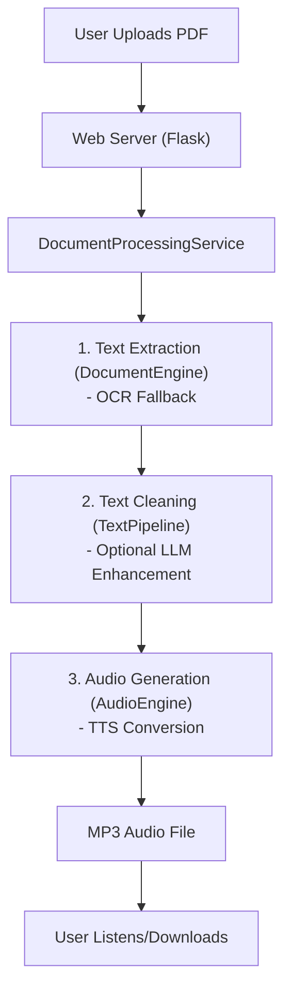

# PDF to Audio Converter

```
 ____  ____  _____   ____   ____   ____  ____
|  _ \|  _ \|  ___| |___ \ |  _ \ / ___|/ ___|
| |_) | | | | |_      __) || |_) | |   \___ \
|  __/| |_| |  _|    / __/ |  _ <| |___ ___) |
|_|   |____/|_|     |_____||_| \_\\____|____/

  Convert academic papers to listenable audio
```

This tool converts PDF documents to audio files so you can listen to academic papers, research documents, or any text-heavy PDFs while commuting, exercising, or wherever you prefer listening over reading. Perfect for turning dense research papers into listening-friendly MP3s for your phone, car, or sharing with others.

## Features

- **PDF Processing**: Extract text from PDFs using pdfplumber with OCR fallback (Tesseract)
- **Text Cleaning**: Optional LLM-powered text processing for better narration (Gemini API)
- **Text-to-Speech**: Two TTS backends:
  - **Piper TTS** — Local neural TTS with natural voices (no API key needed)
  - **Gemini TTS** — Cloud-based TTS via Google's Gemini API
- **Web Interface**: Simple upload → process → download workflow
- **Read-Along Mode**: Word-level timing data with synchronized text highlighting (Piper only)
- **Audio Output**: Generates MP3 files ready for any device

## Workflow Diagram



## Current TTS Voices Available (Piper)

- `en_US-lessac-medium` - US voice, neutral
- `en_GB-alba-medium` - British female voice
- `en_US-ryan-high` - US male voice (auto-downloads)
- `en_GB-cori-high` - British voice (auto-downloads)

Voice models are auto-downloaded from Hugging Face on first use. Switch voices by changing `model_name` in config.yaml.

## Quick Start (Fedora/Linux)

### 1. Install System Dependencies

```bash
# Fedora
sudo dnf install tesseract ffmpeg espeak-ng python3-virtualenv

# Ubuntu/Debian
sudo apt install tesseract-ocr ffmpeg espeak-ng python3-venv

# Arch
sudo pacman -S tesseract ffmpeg espeak-ng python
```

### 2. Setup Application

```bash
git clone <repository-url>
cd silly_PDF2WAV

# Install uv (if not already installed)
curl -LsSf https://astral.sh/uv/install.sh | sh

# Install dependencies (includes Piper TTS)
uv sync --extra dev

# Copy and edit configuration
cp config.example.yaml config.yaml
# Edit config.yaml - set your Google AI API key for text cleaning (optional)
```

### 3. Run the Application

```bash
uv run python app.py
```

Open http://localhost:5000 in your browser, upload a PDF, and get an MP3 back!

## Configuration

The `config.yaml` file controls everything:

```yaml
tts:
  engine: "piper"   # Local neural TTS (no API key needed)
  # engine: "gemini" # Cloud TTS (requires Google AI API key)

  piper:
    model_name: "en_GB-alba-medium"  # British female voice
    models_dir: ".local/piper_models"
```

**Text Cleaning** (optional): Requires a Google AI API key for LLM text processing. Get one free at https://aistudio.google.com/app/apikey

### Environment Variables

When running in a container, override config using environment variables prefixed with `PDF2WAV_`:

- `PDF2WAV_TTS_ENGINE` — `piper` or `gemini`
- `PDF2WAV_SECRETS_GOOGLE_AI_API_KEY` — Your Google AI API key
- `PDF2WAV_APP_PORT` — Port to run on (default 5000)

## Project Structure

```
silly_PDF2WAV/
├── app.py                 # Flask entry point
├── app_factory.py         # Application factory with DI
├── routes.py              # Flask route handlers
├── application/           # App config, context, orchestration
│   ├── config/            # SystemConfig, logging
│   ├── context/           # ApplicationContext (DI wrapper)
│   └── services/          # DocumentProcessingService
├── domain/                # Core business logic (no external deps)
│   ├── audio/             # AudioEngine, TimingEngine
│   ├── text/              # TextPipeline, chunking strategies
│   ├── document/          # DocumentEngine (PDF processing)
│   ├── container/         # ServiceContainer (immutable DI)
│   ├── interfaces.py      # Abstract interfaces
│   └── errors.py          # Result[T] pattern
├── infrastructure/        # External service implementations
│   ├── tts/
│   │   ├── piper_tts_provider.py   # Piper TTS (local)
│   │   └── gemini_tts_provider.py  # Gemini TTS (cloud)
│   ├── llm/               # Gemini LLM for text cleaning
│   ├── ocr/               # Tesseract OCR
│   └── file/              # File management, cleanup scheduler
└── tests/                 # Unit, integration, and benchmark tests
```

## API Endpoints

- `GET /` — Upload interface
- `POST /upload` — Process PDF → MP3
- `POST /upload-with-timing` — Process with word-level timing data
- `GET /read-along/<filename>` — Synchronized reading interface
- `GET /api/timing/<filename>` — Timing metadata as JSON
- `GET /api/progress/<operation_id>` — Processing progress

## Design Constraints

This is a single-user home app, and the background-processing model is deliberately simple:

- Uploads are processed by a bounded in-process worker pool (`performance.max_concurrent_operations` in `config.yaml`, default 2). Uploads beyond the cap queue up rather than being rejected.
- Progress and results live in memory only. A restart loses in-flight work and pending result pages, even though finished audio files remain on disk.
- Run it as a single process (the Flask dev server). Multiple WSGI workers would each get their own progress store, so progress polling would 404 at random.

## Testing

```bash
uv run python -m pytest                       # All tests
uv run python -m pytest tests/unit/           # Unit tests only
uv run python -m pytest tests/integration/    # Integration tests
uv run python -m pytest -k "test_name"        # Specific test
uv run pre-commit run --all-files             # Linting + formatting + type checks
```

## Troubleshooting

**"Audio generation failed"**: Check your TTS engine config in config.yaml and ensure system dependencies are installed.

**"No audio output"**: Check that voice models downloaded correctly (look in `.local/piper_models/` or the configured `models_dir`).

**"Text cleaning failed"**: Verify your Google AI API key is set correctly, or disable text cleaning in config.yaml.

**Import errors**: Use `uv run` to run commands, which ensures the correct virtual environment is active.

## License

See LICENSE file.
