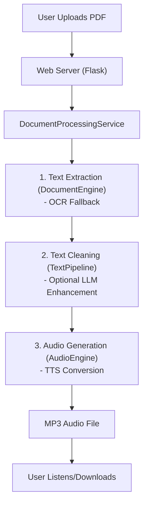

# PDF to Audio Converter

```
 ____  ____  _____   ____   ____   ____  ____
|  _ \|  _ \|  ___| |___ \ |  _ \ / ___|/ ___|
| |_) | | | | |_      __) || |_) | |   \___ \
|  __/| |_| |  _|    / __/ |  _ <| |___ ___) |
|_|   |____/|_|     |_____||_| \_\\____|____/

  Convert academic papers to listenable audio
```

This tool converts PDF documents to audio files so you can listen to academic papers, research documents, or any text-heavy PDFs while commuting, exercising, or wherever you prefer listening over reading. Perfect for turning dense research papers into listening-friendly MP3s for your phone, car, or sharing with others.

## What Actually Works

- **PDF Processing**: Extract text from PDFs using OCR (Tesseract)
- **Text Cleaning**: LLM-powered text processing for better narration (Gemini API)
- **Text-to-Speech**: Local neural TTS with natural voices (Piper TTS)
- **Web Interface**: Simple upload -> process -> download workflow
- **Audio Output**: Generates MP3 files ready for any device

## Workflow Diagram



## Current TTS Voices Available

- `en_US-lessac-medium` - US voice, neutral
- `en_GB-alba-medium` - British female voice
- `en_US-ryan-high` - US male voice (auto-downloads)
- `en_GB-cori-high` - British voice (auto-downloads)

**Note**: The system is currently configured for **Piper TTS only**. While there's a Gemini TTS skeleton in the codebase, it's just a placeholder and doesn't actually generate audio - stick with Piper for real results.

## Quick Start (Fedora/Linux)

### 1. Install System Dependencies

```bash
# Fedora
sudo dnf install tesseract ffmpeg python3-virtualenv

# Ubuntu/Debian
sudo apt install tesseract-ocr ffmpeg python3-venv

# Arch
sudo pacman -S tesseract ffmpeg python
```

### 2. Setup Application

```bash
git clone <repository-url>
cd silly_PDF2WAV

# Create virtual environment
python3 -m venv venv
source venv/bin/activate

# Install dependencies (includes Piper TTS)
pip install -r requirements.txt

# Copy and edit configuration
cp config.example.yaml config.yaml
# Edit config.yaml - set your Google AI API key for text cleaning
```

### 3. Run the Application

```bash
source venv/bin/activate
python app.py
```

Open http://localhost:5000 in your browser, upload a PDF, and get an MP3 back!

## Configuration Notes

The `config.yaml` file controls everything:

```yaml
tts:
  engine: "piper"  # WORKS - Use this
  # engine: "gemini"  # PLACEHOLDER ONLY - Don't use this

  piper:
    model_name: "en_GB-alba-medium"  # British female voice
    models_dir: "voices"             # Where voice models are stored
```

**Voice Models**: The system auto-downloads voice models from Hugging Face when first used. You can switch voices by changing the `model_name` in config.yaml.

**Text Cleaning**: Requires a Google AI API key for the LLM text processing. Get one free at https://aistudio.google.com/app/apikey

## Project Structure

```
pdf_to_audio_app/
├── application/           # App config and startup
├── domain/               # Core business logic
│   ├── audio/           # Audio processing engine
│   ├── text/            # Text chunking and processing
│   ├── document/        # PDF processing engine
│   └── interfaces.py    # Abstract interfaces
├── infrastructure/      # External service implementations
│   ├── tts/
│   │   ├── piper_tts_provider.py     # Real Piper TTS
│   │   └── gemini_tts_provider.py    # Placeholder only
│   ├── llm/            # Gemini text cleaning (works)
│   └── ocr/            # Tesseract OCR (works)
└── tests/              # 200+ tests
```

## API Usage

- `GET /` - Upload interface
- `POST /upload` - Process PDF -> MP3
- `POST /upload-with-timing` - Process with word-level timing data
- `GET /read-along/<filename>` - View with synchronized highlighting

## Testing

```bash
source venv/bin/activate
python -m pytest                    # All tests
python -m pytest tests/unit/        # Unit tests
python -m pytest tests/integration/ # Integration tests
```

## Troubleshooting

**"Audio generation failed"**: Make sure you're using `engine: "piper"` in config.yaml, not `"gemini"`

**"No audio output"**: Check that voice models downloaded correctly in the `voices/` directory

**"Text cleaning failed"**: Verify your Google AI API key is set correctly in config.yaml

**Import errors**: Always use `source venv/bin/activate` before running any commands

## What's Next

The codebase has a clean hexagonal architecture that makes it easy to add:
- Additional TTS providers (OpenAI, Azure, etc.)
- More voice models and languages
- Better SSML support for pronunciation
- Batch processing capabilities

## License

See LICENSE file.
