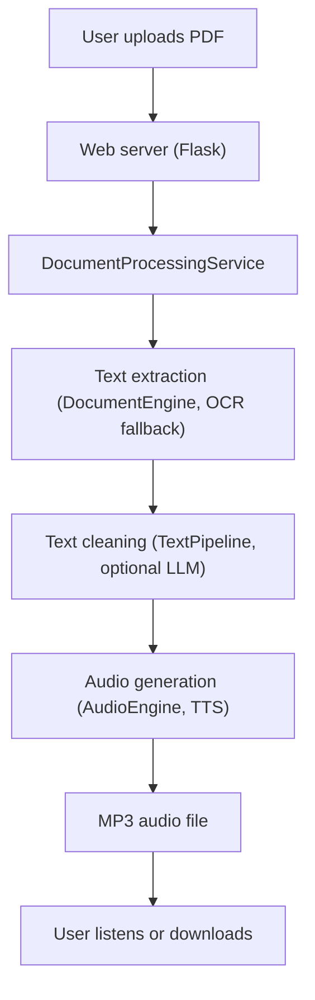
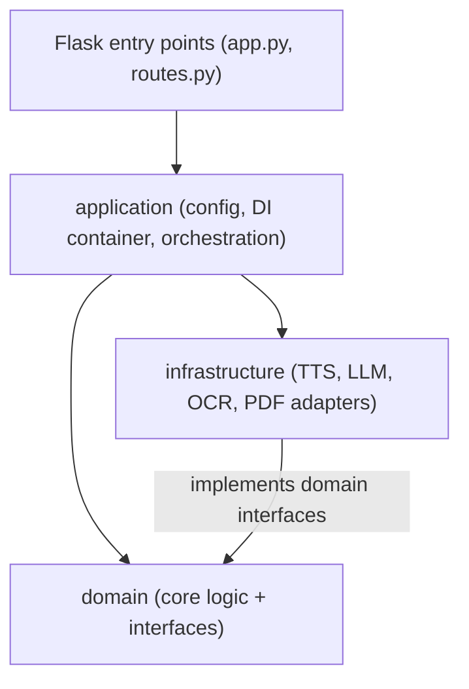

# VerbatimPapers

```
__     __        _           _   _           ____
\ \   / /__ _ __| |__   __ _| |_(_)_ __ ___ |  _ \ __ _ _ __   ___ _ __ ___
 \ \ / / _ \ '__| '_ \ / _` | __| | '_ ` _ \| |_) / _` | '_ \ / _ \ '__/ __|
  \ V /  __/ |  | |_) | (_| | |_| | | | | | |  __/ (_| | |_) |  __/ |  \__ \
   \_/ \___|_|  |_.__/ \__,_|\__|_|_| |_| |_|_|   \__,_| .__/ \___|_|  |___/
                                                       |_|

  Convert academic papers to listenable audio
```

This tool converts PDF documents to audio files so you can listen to academic papers, research documents, or any text-heavy PDFs while commuting, exercising, or wherever you prefer listening over reading. Perfect for turning dense research papers into listening-friendly MP3s for your phone, car, or sharing with others.

## Features

- **PDF Processing**: Extract text from PDFs using pdfplumber with OCR fallback (Tesseract)
- **Text Cleaning**: Optional LLM-powered text processing for better narration (Gemini API)
- **Text-to-Speech**: Two TTS backends:
  - **Piper TTS** — Local neural TTS with natural voices (no API key needed)
  - **Gemini TTS** — Cloud-based TTS via Google's Gemini API
- **Web Interface**: Simple upload → process → download workflow
- **Read-Along Mode**: Word-level timing data with synchronized text highlighting (Piper only)
- **Audio Output**: Generates MP3 files ready for any device

## Workflow Diagram



## Current TTS Voices Available (Piper)

- `en_US-lessac-medium` - US voice, neutral
- `en_GB-alba-medium` - British female voice
- `en_US-ryan-high` - US male voice (auto-downloads)
- `en_GB-cori-high` - British voice (auto-downloads)

Voice models are auto-downloaded from Hugging Face on first use. Switch voices by changing `model_name` in config.yaml.

## Quick Start (Fedora/Linux)

### 1. Install System Dependencies

```bash
# Fedora
sudo dnf install tesseract ffmpeg espeak-ng python3-virtualenv

# Ubuntu/Debian
sudo apt install tesseract-ocr ffmpeg espeak-ng python3-venv

# Arch
sudo pacman -S tesseract ffmpeg espeak-ng python
```

### 2. Setup Application

```bash
git clone <repository-url>
cd VerbatimPapers

# Install uv (if not already installed)
curl -LsSf https://astral.sh/uv/install.sh | sh

# Install dependencies (includes Piper TTS)
uv sync --extra dev

# Copy and edit configuration
cp config.example.yaml config.yaml
# Edit config.yaml - set your Google AI API key for text cleaning (optional)
```

### 3. Run the Application

```bash
uv run python app.py
```

Open http://localhost:5000 in your browser, upload a PDF, and get an MP3 back!

## Configuration

The `config.yaml` file controls everything:

```yaml
tts:
  engine: "piper"   # Local neural TTS (no API key needed)
  # engine: "gemini" # Cloud TTS (requires Google AI API key)

  piper:
    model_name: "en_GB-alba-medium"  # British female voice
    download_dir: "piper_models"
```

**Text Cleaning** (optional): Requires a Google AI API key for LLM text processing. Get one free at https://aistudio.google.com/app/apikey

### Environment Variables

All configuration lives in `config.yaml`; only a few environment variables are read:

- `GEMINI_API_KEY` — Google AI API key (alternative to `secrets.google_ai_api_key` in config.yaml)
- `FLASK_DEBUG` — Override `app.debug`
- `PROJECT_ROOT` — Override the project root used to resolve relative paths

## Architecture

Hexagonal layering: the domain is pure stdlib logic, external services live behind interfaces in the infrastructure layer, and the application layer wires everything together via dependency injection.



## Project Structure

```
VerbatimPapers/
├── app.py                 # Flask entry point
├── app_factory.py         # Application factory with DI
├── routes.py              # Flask route handlers
├── application/           # App config, DI container, orchestration
│   ├── config/            # SystemConfig and section configs
│   ├── container/         # ServiceContainer (concrete DI implementation)
│   ├── context/           # ApplicationContext (immutable app-wide state)
│   └── services/          # DocumentProcessingService, progress store
├── domain/                # Core business logic (stdlib-only, enforced by a test)
│   ├── audio/             # AudioEngine, TimingEngine
│   ├── config/            # TTS config models
│   ├── container/         # IServiceContainer interface
│   ├── document/          # DocumentEngine (extraction + OCR fallback logic)
│   ├── text/              # TextPipeline, chunking strategies
│   ├── interfaces.py      # Abstract interfaces
│   ├── models.py          # Domain models
│   └── errors.py          # Result[T] pattern
├── infrastructure/        # External service implementations
│   ├── tts/
│   │   ├── piper_tts_provider.py   # Piper TTS (local)
│   │   └── gemini_tts_provider.py  # Gemini TTS (cloud)
│   ├── llm/               # Gemini LLM for text cleaning
│   ├── ocr/               # Tesseract OCR
│   ├── pdf/               # pdfplumber text extraction
│   └── file/              # File management, cleanup scheduler
└── tests/                 # Unit, infrastructure, integration, and benchmark tests
```

## API Endpoints

- `GET /` — Upload interface
- `POST /upload` — Process PDF → MP3
- `POST /upload-with-timing` — Process with word-level timing data
- `GET /read-along/<filename>` — Synchronized reading interface
- `GET /api/timing/<filename>` — Timing metadata as JSON
- `GET /api/progress/<operation_id>` — Processing progress
- `POST /api/cancel/<operation_id>` — Cancel a running operation
- `GET /result/<operation_id>` — Result page for a completed operation
- `/admin/*` — File stats and manual cleanup; disabled by default (`admin.enabled` in config.yaml, optional `secrets.admin_token` checked as the `X-Admin-Token` header)

## Design Constraints

This is a single-user home app, and the background-processing model is deliberately simple:

- Uploads are processed by a bounded in-process worker pool (`performance.max_concurrent_operations` in `config.yaml`, default 2). Uploads beyond the cap queue up rather than being rejected.
- Progress and results live in memory only. A restart loses in-flight work and pending result pages, even though finished audio files remain on disk.
- Run it as a single process (the Flask dev server). Multiple WSGI workers would each get their own progress store, so progress polling would 404 at random.

## Deployment

There is deliberately no production deployment story. Before running this anywhere other than your own machine, know:

- The supported run mode is the Flask dev server (`uv run python app.py`), which is not hardened for production traffic.
- Do **not** put it behind gunicorn/uwsgi with multiple workers. Progress and results live in one process's memory (see Design Constraints), so with several workers the progress polling and result pages would 404 at random depending on which worker answers.
- The server binds to `127.0.0.1` by default. If you change `app.host` in config.yaml to expose it on a network, anyone who can reach it can upload PDFs and consume CPU/disk. The `/admin/*` endpoints stay hidden (404) unless you explicitly set `admin.enabled: true`; if you do, also set `secrets.admin_token` so they require an `X-Admin-Token` header.
- For containers, mount a `config.yaml` into the container (plus the environment variables above if needed) — and the single-process constraint still applies: one container, one process.

## Testing

```bash
uv run python -m pytest                       # All tests
uv run python -m pytest tests/unit/           # Unit tests only
uv run python -m pytest tests/integration/    # Integration tests
uv run python -m pytest -k "test_name"        # Specific test
uv run pre-commit run --all-files             # Linting + formatting + type checks
```

## Troubleshooting

**"Audio generation failed"**: Check your TTS engine config in config.yaml and ensure system dependencies are installed.

**"No audio output"**: Check that voice models downloaded correctly (look in `piper_models/` or the configured `download_dir`).

**"Text cleaning failed"**: Verify your Google AI API key is set correctly, or disable text cleaning in config.yaml.

**Import errors**: Use `uv run` to run commands, which ensures the correct virtual environment is active.

## License

See LICENSE file.
