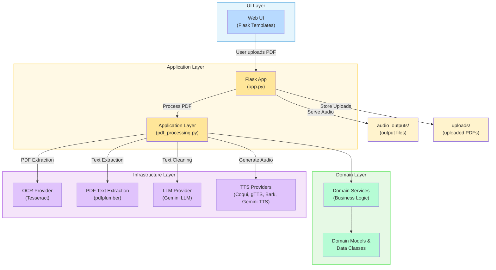

# Silly PDF2WAV – Simplified Architecture Diagram

## Key Layers

- **UI:** Web interface for uploading PDFs and playing audio.
- **Application Layer:** Orchestrates PDF processing, calls domain logic and infrastructure.
- **Domain Layer:** Contains pure business rules, models, and service definitions.
- **Infrastructure Layer:** Integrations with external services (Tesseract OCR, LLMs, TTS engines).
- **Uploads/Audio:** File storage for user uploads and generated audio.

## Main Flow

1. User uploads a PDF via the web UI.
2. `app.py` (Flask) receives the upload and hands PDF to the application service.
3. Application layer uses:
    - OCR (Tesseract) or PDF text extraction
    - LLM (Gemini) for text cleaning
    - TTS providers for audio generation
4. The cleaned audio file is saved and made available for download/playback.